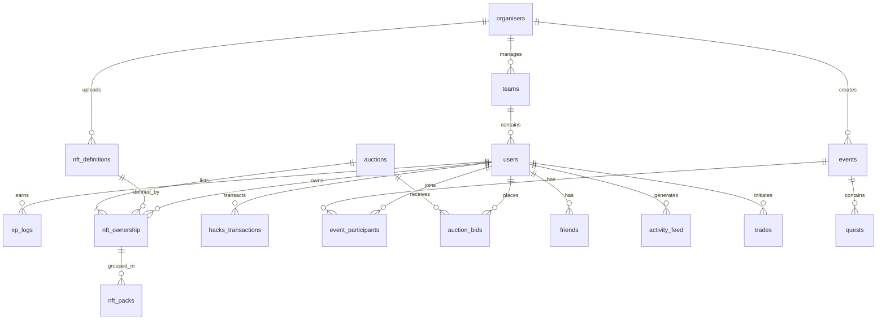

# 🎮 HackQuest — Implementation Plan

> **Gamified Hackathon Web Platform**
> *Discord × Riot Games × OpenSea*

---

## 📋 Table of Contents

1. [Tech Stack & Versions](#tech-stack--versions)
2. [Project Structure](#project-structure)
3. [Database Schema](#database-schema)
4. [Design System](#design-system)
5. [Page-by-Page Breakdown](#page-by-page-breakdown)
6. [API Routes](#api-routes)
7. [Blockchain Integration](#blockchain-integration)
8. [Realtime Architecture](#realtime-architecture)
9. [Implementation Phases](#implementation-phases)

---

## Tech Stack & Versions

| Layer | Technology | Version | Purpose |
|-------|-----------|---------|---------|
| **Framework** | Next.js (App Router) | 14.2.x | Full-stack React framework |
| **Language** | TypeScript | 5.x | Type safety |
| **Styling** | Tailwind CSS | 3.4.x | Utility-first CSS |
| **Components** | shadcn/ui | latest | Headless UI primitives |
| **Animations** | Framer Motion | 11.x | Page transitions, UI animations |
| **Database** | Supabase (Postgres 17) | — | DB + Auth + Storage + Realtime |
| **Auth** | Supabase Auth + `@supabase/ssr` | 2.x | Cookie-based SSR auth |
| **Realtime** | Supabase Realtime (Broadcast + Postgres Changes) | — | Live leaderboard, activity feed, auction bids |
| **Blockchain (Solana)** | `@solana/web3.js` + `@metaplex-foundation/js` | 1.9x / 0.20x | NFT minting on Solana |
| **Blockchain (Algorand)** | `algosdk` | 2.x | XP audit ledger, Hacks transaction trail |
| **Wallet (Solana)** | `@solana/wallet-adapter-react` | 0.15.x | Phantom / Solflare connection |
| **Wallet (Algorand)** | `@perawallet/connect` | 1.x | Pera Wallet connection |
| **IPFS** | Pinata SDK | 2.x | NFT metadata hosting |
| **Pricing API** | CoinGecko API (free tier) | v3 | SOL/ALGO → USDC price |
| **Fonts** | Google Fonts | — | Space Grotesk + Inter |
| **Icons** | Lucide React | latest | Icon library |
| **Forms** | React Hook Form + Zod | 7.x / 3.x | Form validation |
| **State** | Zustand | 4.x | Client-side state management |

> [!IMPORTANT]
> We will NOT use Socket.io. Supabase Realtime (Broadcast + Postgres Changes) provides equivalent functionality natively — live leaderboard updates, activity feeds, and auction bid streaming — without an extra WebSocket server. This simplifies deployment and reduces infrastructure costs.

---

## Project Structure

```
hackquest/
├── .env.local                          # Supabase URL, keys, blockchain config
├── next.config.mjs                     # Next.js configuration
├── tailwind.config.ts                 # Tailwind with HackQuest design tokens
├── tsconfig.json
├── package.json
├── middleware.ts                       # Supabase session refresh proxy
│
├── public/
│   ├── fonts/                         # Space Grotesk & Inter (self-hosted)
│   ├── images/                        # Static assets, logo, og-image
│   └── particles/                     # Particle config for hero
│
├── lib/
│   ├── supabase/
│   │   ├── client.ts                  # Browser Supabase client
│   │   ├── server.ts                  # Server Supabase client
│   │   ├── middleware.ts              # Session update logic
│   │   └── admin.ts                   # Service-role client (server-only)
│   ├── blockchain/
│   │   ├── solana/
│   │   │   ├── connection.ts          # Solana RPC connection
│   │   │   ├── mint-nft.ts            # Metaplex NFT mint (stub → real)
│   │   │   └── wallet-adapter.tsx     # Wallet adapter provider
│   │   └── algorand/
│   │       ├── client.ts              # Algorand client setup
│   │       ├── xp-ledger.ts           # Write XP audit to Algorand
│   │       └── hacks-audit.ts         # Write Hacks transactions
│   ├── ipfs/
│   │   └── pinata.ts                  # Upload metadata to IPFS via Pinata
│   ├── pricing/
│   │   └── coingecko.ts              # SOL/ALGO → USDC price fetcher
│   ├── constants.ts                   # Colors, rates, config constants
│   ├── utils.ts                       # General utilities
│   └── types/
│       ├── database.ts               # Supabase generated types
│       ├── nft.ts                     # NFT-related types
│       └── blockchain.ts             # Blockchain transaction types
│
├── components/
│   ├── ui/                            # shadcn/ui components (auto-generated)
│   │   ├── button.tsx
│   │   ├── card.tsx
│   │   ├── dialog.tsx
│   │   ├── dropdown-menu.tsx
│   │   ├── input.tsx
│   │   ├── badge.tsx
│   │   ├── tabs.tsx
│   │   ├── table.tsx
│   │   ├── avatar.tsx
│   │   ├── progress.tsx
│   │   ├── skeleton.tsx
│   │   ├── toast.tsx
│   │   └── ... (more as needed)
│   ├── layout/
│   │   ├── Navbar.tsx                 # Global nav with glassmorphism
│   │   ├── Footer.tsx                 # Platform footer
│   │   ├── Sidebar.tsx                # Dashboard sidebar
│   │   └── PageTransition.tsx         # Framer Motion page wrapper
│   ├── landing/
│   │   ├── HeroSection.tsx            # Particle bg + animated logo + CTA
│   │   ├── LeaderboardWidget.tsx      # Live top-10 preview
│   │   ├── EventsTeaser.tsx           # 3 featured event cards
│   │   └── ActivityTicker.tsx         # Real-time activity feed ribbon
│   ├── auth/
│   │   ├── PlayerLoginForm.tsx        # Login with username/email/phone
│   │   ├── PlayerRegisterForm.tsx     # Full registration form
│   │   ├── OrganiserLoginForm.tsx     # Organiser-only login
│   │   ├── AuthModal.tsx              # Glassmorphism prompt modal
│   │   └── ProfileDropdown.tsx        # Avatar + dropdown menu
│   ├── dashboard/
│   │   ├── OverviewPanel.tsx          # XP bar, rank, recent activity
│   │   ├── WalletPanel.tsx            # Hacks balance, deposit, withdraw
│   │   ├── NFTGrid.tsx                # Owned NFTs grid + pack badges
│   │   ├── NFTDetailPanel.tsx         # Side panel for NFT actions
│   │   ├── FriendsPanel.tsx           # Friend list + requests
│   │   └── TransactionHistory.tsx     # Wallet transaction table
│   ├── events/
│   │   ├── EventCard.tsx              # Event card with status badge
│   │   ├── EventFilters.tsx           # Filter tabs [All][Running]...
│   │   ├── EventLeaderboard.tsx       # Completed event leaderboard
│   │   └── CountdownTimer.tsx         # Live countdown component
│   ├── showplace/
│   │   ├── NFTShowTile.tsx            # NFT tile with claim/owner status
│   │   ├── CategorySidebar.tsx        # Discord-like category nav
│   │   ├── RedemptionModal.tsx        # XP redemption confirmation
│   │   └── PremiumNFTCard.tsx         # Premium NFT with auction link
│   ├── auction/
│   │   ├── AuctionCard.tsx            # Active auction listing card
│   │   ├── BidModal.tsx               # Place bid dialog
│   │   ├── SellNFTModal.tsx           # List NFT for auction
│   │   ├── BidHistory.tsx             # Bid log with live updates
│   │   └── AuctionCountdown.tsx       # Live auction timer
│   ├── organiser/
│   │   ├── EventManager.tsx           # CRUD for events
│   │   ├── NFTUploader.tsx            # Upload NFT definitions
│   │   ├── PlayerTable.tsx            # All players management table
│   │   ├── PlayerDetailView.tsx       # Full player profile view
│   │   ├── TeamManager.tsx            # Team CRUD
│   │   └── ActivityLog.tsx            # Real-time organiser log
│   └── shared/
│       ├── GlassPanel.tsx             # Glassmorphism container
│       ├── NeonBadge.tsx              # Neon-glow rank/status badge
│       ├── AnimatedCounter.tsx        # Number animation component
│       ├── RarityBorder.tsx           # Colour-coded border by rarity
│       ├── WalletConnectButton.tsx    # Multi-wallet connect button
│       └── EmptyState.tsx             # Empty state illustrations
│
├── app/
│   ├── layout.tsx                     # Root layout (fonts, providers)
│   ├── page.tsx                       # Landing page
│   ├── globals.css                    # Tailwind + custom CSS variables
│   ├── loading.tsx                    # Global loading state
│   ├── error.tsx                      # Global error boundary
│   │
│   ├── (auth)/
│   │   ├── login/
│   │   │   └── page.tsx               # Player login page
│   │   ├── register/
│   │   │   └── page.tsx               # Player registration page
│   │   ├── organiser-login/
│   │   │   └── page.tsx               # Organiser login page
│   │   └── auth/
│   │       ├── callback/
│   │       │   └── route.ts           # OAuth callback handler
│   │       ├── confirm/
│   │       │   └── route.ts           # Email confirm handler
│   │       └── signout/
│   │           └── route.ts           # Sign out handler
│   │
│   ├── (main)/
│   │   ├── layout.tsx                 # Main layout (nav stays visible)
│   │   ├── events/
│   │   │   ├── page.tsx               # Events listing page
│   │   │   └── [id]/
│   │   │       └── page.tsx           # Event detail / leaderboard
│   │   ├── showplace/
│   │   │   └── page.tsx               # NFT Showplace page
│   │   └── auction/
│   │       ├── page.tsx               # Auction listings
│   │       └── [id]/
│   │           └── page.tsx           # Single auction detail
│   │
│   ├── (dashboard)/
│   │   ├── layout.tsx                 # Dashboard layout with sidebar
│   │   └── dashboard/
│   │       ├── page.tsx               # Overview (redirects to overview)
│   │       ├── overview/
│   │       │   └── page.tsx           # XP, level, rank, activity
│   │       ├── nfts/
│   │       │   └── page.tsx           # Owned NFTs grid
│   │       ├── friends/
│   │       │   └── page.tsx           # Friends management
│   │       ├── wallet/
│   │       │   └── page.tsx           # Hacks wallet
│   │       └── settings/
│   │           └── page.tsx           # Profile settings
│   │
│   ├── (organiser)/
│   │   ├── layout.tsx                 # Organiser layout with sidebar
│   │   └── organiser/
│   │       ├── page.tsx               # Organiser overview
│   │       ├── events/
│   │       │   └── page.tsx           # Manage events
│   │       ├── nfts/
│   │       │   └── page.tsx           # Manage NFT definitions
│   │       ├── players/
│   │       │   ├── page.tsx           # Player management table
│   │       │   └── [id]/
│   │       │       └── page.tsx       # Player detail
│   │       ├── teams/
│   │       │   └── page.tsx           # Team management
│   │       └── activity/
│   │           └── page.tsx           # Real-time activity log
│   │
│   └── api/
│       ├── auth/
│       │   └── [...supabase]/
│       │       └── route.ts           # Supabase auth handlers
│       ├── wallet/
│       │   ├── deposit/
│       │   │   └── route.ts           # Handle crypto → Hacks conversion
│       │   └── withdraw/
│       │       └── route.ts           # Handle Hacks → crypto withdrawal
│       ├── nft/
│       │   ├── mint/
│       │   │   └── route.ts           # Mint NFT on Solana (stub first)
│       │   ├── redeem/
│       │   │   └── route.ts           # Redeem basic NFT with XP
│       │   └── transfer/
│       │       └── route.ts           # Transfer NFT ownership
│       ├── auction/
│       │   ├── create/
│       │   │   └── route.ts           # Create new auction listing
│       │   ├── bid/
│       │   │   └── route.ts           # Place bid on auction
│       │   └── settle/
│       │       └── route.ts           # Settle completed auction
│       ├── events/
│       │   ├── join/
│       │   │   └── route.ts           # Join event
│       │   └── award-xp/
│       │       └── route.ts           # Award XP to player
│       ├── blockchain/
│       │   ├── algorand-audit/
│       │   │   └── route.ts           # Write to Algorand ledger
│       │   └── solana-mint/
│       │       └── route.ts           # Mint on Solana
│       ├── pricing/
│       │   └── route.ts               # Get SOL/ALGO/USDC prices
│       └── leaderboard/
│           └── route.ts               # Leaderboard data endpoint
│
├── hooks/
│   ├── useUser.ts                     # Current user hook
│   ├── useLeaderboard.ts             # Real-time leaderboard subscription
│   ├── useActivityFeed.ts            # Real-time activity feed
│   ├── useAuctionBids.ts             # Real-time auction bid updates
│   ├── useWallet.ts                   # Hacks wallet state
│   ├── useNFTs.ts                     # User's NFT collection
│   └── usePricing.ts                 # Crypto price polling
│
├── stores/
│   ├── authStore.ts                   # Auth state (Zustand)
│   ├── walletStore.ts                 # Wallet connection state
│   └── uiStore.ts                     # UI state (modals, toasts)
│
└── providers/
    ├── ThemeProvider.tsx              # Dark theme provider
    ├── AuthProvider.tsx               # Supabase auth context
    ├── WalletProvider.tsx             # Solana + Algorand wallet context
    ├── ToastProvider.tsx              # Toast notifications
    └── RealtimeProvider.tsx           # Supabase realtime subscriptions
```

---

## Database Schema

> [!NOTE]
> We will use **Supabase Auth** for authentication (using `auth.users` table). Our custom tables reference `auth.users.id` as foreign keys. All tables live in the `public` schema with RLS enabled.

### Entity Relationship Diagram



### Table Definitions

#### `users` (extends `auth.users`)
```sql
CREATE TABLE public.users (
    id              UUID PRIMARY KEY REFERENCES auth.users(id) ON DELETE CASCADE,
    username        TEXT UNIQUE NOT NULL,
    display_name    TEXT NOT NULL,
    email           TEXT UNIQUE NOT NULL,
    phone           TEXT,
    avatar_url      TEXT,
    college_name    TEXT,
    date_of_birth   DATE,
    linkedin_url    TEXT,
    instagram_handle TEXT,
    twitter_handle  TEXT,
    team_id         UUID REFERENCES public.teams(id),
    custom_team_name TEXT,  -- if "Others" selected
    total_xp        BIGINT DEFAULT 0,
    cumulative_xp   BIGINT DEFAULT 0,  -- never decreases on NFT sale
    hacks_balance   BIGINT DEFAULT 0,  -- in-app currency
    nft_count       INT DEFAULT 0,
    player_level    INT DEFAULT 1,
    rank_position   INT,
    solana_wallet   TEXT,
    algorand_wallet TEXT,
    role            TEXT DEFAULT 'player' CHECK (role IN ('player', 'organiser', 'admin')),
    is_active       BOOLEAN DEFAULT TRUE,
    created_at      TIMESTAMPTZ DEFAULT NOW(),
    updated_at      TIMESTAMPTZ DEFAULT NOW()
);
```

#### `organisers`
```sql
CREATE TABLE public.organisers (
    id              UUID PRIMARY KEY REFERENCES auth.users(id) ON DELETE CASCADE,
    display_name    TEXT NOT NULL,
    email           TEXT UNIQUE NOT NULL,
    organization    TEXT,
    permissions     JSONB DEFAULT '["events","nfts","players","teams"]'::JSONB,
    created_at      TIMESTAMPTZ DEFAULT NOW()
);
```

#### `teams`
```sql
CREATE TABLE public.teams (
    id              UUID PRIMARY KEY DEFAULT gen_random_uuid(),
    name            TEXT UNIQUE NOT NULL,
    created_by      UUID REFERENCES public.organisers(id),
    max_members     INT DEFAULT 5,
    created_at      TIMESTAMPTZ DEFAULT NOW()
);
```

#### `events`
```sql
CREATE TABLE public.events (
    id              UUID PRIMARY KEY DEFAULT gen_random_uuid(),
    name            TEXT NOT NULL,
    description     TEXT,
    banner_image    TEXT,
    organiser_id    UUID REFERENCES public.organisers(id),
    status          TEXT DEFAULT 'upcoming' CHECK (status IN ('upcoming', 'running', 'completed')),
    start_date      TIMESTAMPTZ NOT NULL,
    end_date        TIMESTAMPTZ NOT NULL,
    prize_info      TEXT,
    tags            TEXT[] DEFAULT '{}',
    max_participants INT,
    is_team_event   BOOLEAN DEFAULT FALSE,
    created_at      TIMESTAMPTZ DEFAULT NOW(),
    updated_at      TIMESTAMPTZ DEFAULT NOW()
);
```

#### `event_participants`
```sql
CREATE TABLE public.event_participants (
    id              UUID PRIMARY KEY DEFAULT gen_random_uuid(),
    event_id        UUID NOT NULL REFERENCES public.events(id) ON DELETE CASCADE,
    user_id         UUID NOT NULL REFERENCES public.users(id) ON DELETE CASCADE,
    team_id         UUID REFERENCES public.teams(id),
    xp_earned       BIGINT DEFAULT 0,
    joined_at       TIMESTAMPTZ DEFAULT NOW(),
    UNIQUE(event_id, user_id)
);
```

#### `quests`
```sql
CREATE TABLE public.quests (
    id              UUID PRIMARY KEY DEFAULT gen_random_uuid(),
    event_id        UUID NOT NULL REFERENCES public.events(id) ON DELETE CASCADE,
    name            TEXT NOT NULL,
    description     TEXT,
    xp_reward       INT NOT NULL DEFAULT 0,
    quest_type      TEXT DEFAULT 'challenge',
    is_active       BOOLEAN DEFAULT TRUE,
    created_at      TIMESTAMPTZ DEFAULT NOW()
);
```

#### `xp_logs`
```sql
CREATE TABLE public.xp_logs (
    id              UUID PRIMARY KEY DEFAULT gen_random_uuid(),
    user_id         UUID NOT NULL REFERENCES public.users(id) ON DELETE CASCADE,
    amount          BIGINT NOT NULL,
    source          TEXT NOT NULL,  -- 'quest', 'event_award', 'nft_trade', 'nft_redeem'
    source_id       UUID,           -- quest_id, event_id, trade_id, etc.
    algo_tx_id      TEXT,           -- Algorand transaction hash
    created_at      TIMESTAMPTZ DEFAULT NOW()
);
```

#### `nft_definitions`
```sql
CREATE TABLE public.nft_definitions (
    id              UUID PRIMARY KEY DEFAULT gen_random_uuid(),
    name            TEXT NOT NULL,
    description     TEXT,
    image_url       TEXT NOT NULL,
    nft_type        TEXT NOT NULL CHECK (nft_type IN ('basic', 'premium')),
    rarity_color    TEXT NOT NULL,  -- e.g., 'purple', 'gold', 'cyan', 'red'
    xp_cost         INT,           -- XP cost to redeem (basic only)
    event_id        UUID REFERENCES public.events(id),  -- premium only: linked event
    total_supply    INT DEFAULT 1,
    minted_count    INT DEFAULT 0,
    ipfs_hash       TEXT,          -- IPFS metadata CID
    created_by      UUID REFERENCES public.organisers(id),
    created_at      TIMESTAMPTZ DEFAULT NOW()
);
```

#### `nft_ownership`
```sql
CREATE TABLE public.nft_ownership (
    id              UUID PRIMARY KEY DEFAULT gen_random_uuid(),
    nft_def_id      UUID NOT NULL REFERENCES public.nft_definitions(id),
    owner_id        UUID NOT NULL REFERENCES public.users(id),
    solana_mint_addr TEXT,         -- Solana NFT mint address
    solana_tx_hash  TEXT,          -- Mint transaction hash
    algo_audit_tx   TEXT,          -- Algorand audit transaction
    acquired_via    TEXT NOT NULL CHECK (acquired_via IN ('redeem', 'event_win', 'auction', 'trade')),
    acquired_at     TIMESTAMPTZ DEFAULT NOW(),
    is_listed       BOOLEAN DEFAULT FALSE  -- if currently in auction
);
```

#### `nft_packs`
```sql
CREATE TABLE public.nft_packs (
    id              UUID PRIMARY KEY DEFAULT gen_random_uuid(),
    owner_id        UUID NOT NULL REFERENCES public.users(id),
    rarity_color    TEXT NOT NULL,
    nft_ids         UUID[] NOT NULL,  -- array of 3 nft_ownership IDs
    is_tradable     BOOLEAN DEFAULT TRUE,
    created_at      TIMESTAMPTZ DEFAULT NOW()
);
```

#### `auctions`
```sql
CREATE TABLE public.auctions (
    id              UUID PRIMARY KEY DEFAULT gen_random_uuid(),
    seller_id       UUID NOT NULL REFERENCES public.users(id),
    nft_ownership_id UUID REFERENCES public.nft_ownership(id),
    nft_pack_id     UUID REFERENCES public.nft_packs(id),
    auction_type    TEXT NOT NULL CHECK (auction_type IN ('single_premium', 'basic_pack')),
    starting_price  BIGINT NOT NULL,  -- in Hacks
    current_bid     BIGINT DEFAULT 0,
    highest_bidder  UUID REFERENCES public.users(id),
    status          TEXT DEFAULT 'active' CHECK (status IN ('active', 'ended', 'cancelled')),
    start_time      TIMESTAMPTZ DEFAULT NOW(),
    end_time        TIMESTAMPTZ NOT NULL,
    created_at      TIMESTAMPTZ DEFAULT NOW()
);
```

#### `auction_bids`
```sql
CREATE TABLE public.auction_bids (
    id              UUID PRIMARY KEY DEFAULT gen_random_uuid(),
    auction_id      UUID NOT NULL REFERENCES public.auctions(id) ON DELETE CASCADE,
    bidder_id       UUID NOT NULL REFERENCES public.users(id),
    bid_amount      BIGINT NOT NULL,
    created_at      TIMESTAMPTZ DEFAULT NOW()
);
```

#### `trades`
```sql
CREATE TABLE public.trades (
    id              UUID PRIMARY KEY DEFAULT gen_random_uuid(),
    sender_id       UUID NOT NULL REFERENCES public.users(id),
    receiver_id     UUID NOT NULL REFERENCES public.users(id),
    nft_ownership_id UUID REFERENCES public.nft_ownership(id),
    nft_pack_id     UUID REFERENCES public.nft_packs(id),
    hacks_amount    BIGINT DEFAULT 0,  -- if any Hacks exchanged
    status          TEXT DEFAULT 'pending' CHECK (status IN ('pending', 'accepted', 'rejected', 'completed')),
    solana_tx_hash  TEXT,
    algo_audit_tx   TEXT,
    created_at      TIMESTAMPTZ DEFAULT NOW(),
    completed_at    TIMESTAMPTZ
);
```

#### `hacks_transactions`
```sql
CREATE TABLE public.hacks_transactions (
    id              UUID PRIMARY KEY DEFAULT gen_random_uuid(),
    user_id         UUID NOT NULL REFERENCES public.users(id),
    tx_type         TEXT NOT NULL CHECK (tx_type IN ('deposit', 'withdraw', 'nft_purchase', 'nft_sale', 'auction_bid', 'auction_refund', 'trade')),
    amount          BIGINT NOT NULL,  -- positive = credit, negative = debit
    currency        TEXT,             -- 'SOL', 'ALGO', 'HACKS'
    crypto_amount   NUMERIC,          -- actual crypto amount
    crypto_tx_hash  TEXT,             -- on-chain transaction hash
    algo_audit_tx   TEXT,             -- Algorand audit trail
    description     TEXT,
    created_at      TIMESTAMPTZ DEFAULT NOW()
);
```

#### `friends`
```sql
CREATE TABLE public.friends (
    id              UUID PRIMARY KEY DEFAULT gen_random_uuid(),
    user_id         UUID NOT NULL REFERENCES public.users(id),
    friend_id       UUID NOT NULL REFERENCES public.users(id),
    status          TEXT DEFAULT 'pending' CHECK (status IN ('pending', 'accepted', 'blocked')),
    created_at      TIMESTAMPTZ DEFAULT NOW(),
    UNIQUE(user_id, friend_id)
);
```

#### `activity_feed`
```sql
CREATE TABLE public.activity_feed (
    id              UUID PRIMARY KEY DEFAULT gen_random_uuid(),
    user_id         UUID REFERENCES public.users(id),
    activity_type   TEXT NOT NULL,  -- 'nft_mint', 'rank_change', 'event_join', 'deposit', 'withdraw', 'auction_bid', etc.
    message         TEXT NOT NULL,
    metadata        JSONB DEFAULT '{}',
    is_public       BOOLEAN DEFAULT TRUE,
    created_at      TIMESTAMPTZ DEFAULT NOW()
);
```

---

## Design System

### Color Palette

| Token | Hex | Usage |
|-------|-----|-------|
| `--bg-primary` | `#0A0A0F` | Page background |
| `--bg-secondary` | `#0F0F18` | Card/panel background |
| `--bg-tertiary` | `#161625` | Elevated surfaces |
| `--accent-purple` | `#7C3AED` | Primary accent |
| `--accent-violet` | `#A855F7` | Secondary accent / hover |
| `--accent-glow` | `#C084FC` | Neon glow effects |
| `--gold` | `#F59E0B` | XP, ranks, premium |
| `--gold-light` | `#FBBF24` | Gold hover/glow |
| `--success` | `#10B981` | Success states |
| `--danger` | `#EF4444` | Error / danger |
| `--warning` | `#F59E0B` | Warnings |
| `--text-primary` | `#F8FAFC` | Primary text |
| `--text-secondary` | `#94A3B8` | Secondary text |
| `--text-muted` | `#64748B` | Muted text |
| `--glass-bg` | `rgba(255,255,255,0.05)` | Glassmorphism fill |
| `--glass-border` | `rgba(255,255,255,0.10)` | Glassmorphism border |

### NFT Rarity Colors

| Rarity | Color | Border Glow |
|--------|-------|-------------|
| Common | `#94A3B8` (Slate) | Subtle white glow |
| Rare | `#3B82F6` (Blue) | Blue neon glow |
| Epic | `#A855F7` (Purple) | Purple neon glow |
| Legendary | `#F59E0B` (Gold) | Gold pulsing glow |
| Mythic | `#EF4444` (Red) | Red fire glow |

### Typography

| Element | Font | Weight | Size |
|---------|------|--------|------|
| H1 | Space Grotesk | 700 | 48px / 3rem |
| H2 | Space Grotesk | 600 | 36px / 2.25rem |
| H3 | Space Grotesk | 600 | 24px / 1.5rem |
| H4 | Space Grotesk | 500 | 20px / 1.25rem |
| Body | Inter | 400 | 16px / 1rem |
| Body-sm | Inter | 400 | 14px / 0.875rem |
| Caption | Inter | 500 | 12px / 0.75rem |
| Button | Inter | 600 | 14px / 0.875rem |

### Glassmorphism Spec

```css
.glass-panel {
    background: rgba(255, 255, 255, 0.05);
    backdrop-filter: blur(20px);
    -webkit-backdrop-filter: blur(20px);
    border: 1px solid rgba(255, 255, 255, 0.10);
    border-radius: 16px;
    box-shadow: 0 8px 32px rgba(0, 0, 0, 0.4);
}
```

### Animations

| Animation | Trigger | Library |
|-----------|---------|---------|
| Page transitions | Route change | Framer Motion `AnimatePresence` |
| Leaderboard rank change | Realtime update | Framer Motion `layout` + `spring` |
| NFT card hover | Hover | Framer Motion `whileHover` |
| Activity ticker | Auto-scroll | CSS animation + Framer Motion |
| Auction countdown | Per-second | `requestAnimationFrame` |
| Number counters | Value change | Framer Motion `motion.span` + `useMotionValue` |
| Particle background | Ambient | `tsparticles` library |
| Glow pulse | Ambient | CSS `@keyframes` |

---

## Page-by-Page Breakdown

### 1. Landing Page (`/`)

| Section | Details |
|---------|---------|
| **Hero** | Full-viewport with animated particle background (`tsparticles`). Large "HACKQUEST" title in Space Grotesk with animated gradient. Subtitle text with typewriter effect. Two CTA buttons: "Explore Events" and "Join Now". |
| **Live Leaderboard Widget** | Glass panel showing top 10 players. Columns: Rank (with animated changes), Avatar, Username, NFT Count, Total XP. Sorted by NFT count first, XP as tiebreaker. Updates in real-time via Supabase Realtime. |
| **Events Teaser** | 3 featured event cards with banner images, glass overlay, event name, dates, tags, participant count. Animated on scroll via Framer Motion. |
| **Activity Ticker** | Horizontal scrolling ribbon: "[Player] just minted Bug Slayer NFT", "[Player] moved to Rank #2". Real-time via Supabase Broadcast. |
| **Navbar** | Fixed top. Logo left. Nav links center (Events, Showplace, Auction). Right: Login dropdown with "Player Login" and "Organiser Login". After login: avatar + username with glassmorphism dropdown → "Go to Dashboard". |
| **Footer** | Platform info, links, social icons. Glass panel aesthetic. |

### 2. Player Auth (`/login`, `/register`)

**Login Page:**
- Glassmorphism form panel centered on dark background
- Input: Username OR Email OR Phone + Password
- "Remember Me" toggle, "Forgot Password" link
- Login button with gradient + glow
- Link to Register page
- After login → redirect to landing page, profile menu appears

**Register Page:**
- Multi-step or single-page form with glassmorphism
- Fields: display name, username, email, password, phone, profile image upload (drag-and-drop), college name, date of birth, LinkedIn URL, Instagram handle, X handle, team name (dropdown from organiser-created teams + "Others" free text)
- Image upload → Supabase Storage bucket `avatars`
- Validation: Zod schema, React Hook Form
- After register → email verify → redirect to landing page

### 3. Organiser Auth (`/organiser-login`)

- Separate page, no public registration
- Email + password login only
- After login → landing page with "Organiser" badge in nav
- Dropdown → "Organiser Dashboard"

### 4. Player Dashboard (`/dashboard/*`)

**Layout:** Dark sidebar (collapsed/expand) + main content area

| Sub-page | Features |
|----------|----------|
| **Overview** | XP progress bar (animated), current level with badge, rank position with global context, recent quest completions list, activity feed (real-time) |
| **NFTs** | Grid of owned NFTs with rarity colour-coded borders. Each card: image, name, type badge (Basic/Premium), rarity color. Basic NFTs show collection progress (e.g., "2/3 Purple"). "Pack Eligible" badge when 3 of same colour. Click NFT → side panel with options: Trade, List on Auction, View on Solana Explorer. |
| **Friends** | Friend list with avatars, status indicators. Send friend request by username search. View friend's NFT collection and XP. Accept/reject incoming requests. |
| **Wallet** | Balance display in Hacks with SOL/ALGO equivalent (live prices). "Add Money" → modal: connect wallet, enter amount, deposit crypto → convert to Hacks. "Withdraw" → modal: convert Hacks → crypto → send to wallet. Transaction history table with filters. |
| **Settings** | Edit profile fields, change password, manage wallet connections, delete account. |

### 5. Events Page (`/events`)

- Grid layout with filter tabs: **All**, **Running**, **Upcoming**, **Completed**
- Each event card: banner image, glass overlay, event name, organiser, dates, prize info, tags, participant count
- **Running:** green pulse indicator, live participant count, time remaining
- **Upcoming:** countdown timer
- **Completed:** click to view event leaderboard (top players/teams)
- Join button (if logged in) or "Login to Join" prompt

### 6. NFT Showplace (`/showplace`)

**Layout:** Discord-style — left sidebar with NFT categories/colours, main grid

| Section | Details |
|---------|---------|
| **Left Sidebar** | Category list: All, by rarity colour, by type (Basic/Premium), Claimed/Unclaimed filters |
| **Premium NFTs** | Large cards with premium border glow, owner info or "Available at Auction" link |
| **Basic NFT Tiles** | Cards showing: image, name, XP cost. States: "Claim for [X] XP" (unclaimed), "Claimed by YOU" (green), "Claimed by [Player Name]" (grey). Click unclaimed → redemption modal showing current XP vs required XP. |

### 7. Auction Page (`/auction`)

| Feature | Details |
|---------|---------|
| **Active Auctions Grid** | Cards with: NFT image, name, current bid in Hacks, time remaining (live countdown), seller username |
| **Guest Prompt** | Not logged in + clicks "Place Bid" → glassmorphism modal: "Login to participate in auctions" with Login and Register buttons |
| **Place Bid** | Logged in: input field for Hacks amount (must exceed current bid), confirm button, balance check |
| **Sell NFT** | Select eligible NFTs (Basic Pack of 3 same colour, or Premium), set starting price, set duration |
| **Bid History** | Expandable panel per auction showing all bids with timestamps, live updates via Realtime |
| **Auction History** | Tab showing past completed auctions with final prices |

### 8. Organiser Dashboard (`/organiser/*`)

| Sub-page | Features |
|----------|----------|
| **Events** | CRUD: Add/Edit/Delete events. Form: name, description, banner upload, dates, prize info, tags, max participants, team event toggle |
| **NFTs** | Upload NFT definitions: image upload, name, description, rarity colour, type (Basic/Premium), XP cost (if Basic), linked event (if Premium), supply count |
| **Players** | Full table: username, college, team, XP, NFT count, Hacks balance, join date. Search, sort, filter. Click row → detail view. |
| **Player Detail** | Full profile including all fields, hashed password display, all transactions, all owned NFTs. Delete player button with confirmation modal. |
| **Teams** | Create/edit/delete team names that appear in player registration dropdown |
| **Activity Log** | Real-time feed: deposits, withdrawals, mints, new player joins. Each entry: timestamp, player, action, amount/detail. |

---

## API Routes

### Auth Routes

| Method | Route | Description |
|--------|-------|-------------|
| POST | `/api/auth/register` | Player registration |
| POST | `/api/auth/login` | Player login (email/username/phone) |
| POST | `/api/auth/organiser-login` | Organiser login |
| GET | `/app/(auth)/auth/callback/route.ts` | OAuth callback |
| GET | `/app/(auth)/auth/confirm/route.ts` | Email confirmation |
| POST | `/app/(auth)/auth/signout/route.ts` | Sign out |

### Wallet Routes

| Method | Route | Description |
|--------|-------|-------------|
| POST | `/api/wallet/deposit` | Convert crypto → Hacks |
| POST | `/api/wallet/withdraw` | Convert Hacks → crypto |
| GET | `/api/pricing` | Get SOL/ALGO/USDC prices |

### NFT Routes

| Method | Route | Description |
|--------|-------|-------------|
| POST | `/api/nft/mint` | Mint NFT on Solana |
| POST | `/api/nft/redeem` | Redeem basic NFT with XP |
| POST | `/api/nft/transfer` | Transfer NFT between players |

### Auction Routes

| Method | Route | Description |
|--------|-------|-------------|
| POST | `/api/auction/create` | List NFT for auction |
| POST | `/api/auction/bid` | Place bid |
| POST | `/api/auction/settle` | Settle completed auction |

### Event Routes

| Method | Route | Description |
|--------|-------|-------------|
| POST | `/api/events/join` | Join event |
| POST | `/api/events/award-xp` | Award XP to player (organiser) |

### Blockchain Routes

| Method | Route | Description |
|--------|-------|-------------|
| POST | `/api/blockchain/algorand-audit` | Write audit entry to Algorand |
| POST | `/api/blockchain/solana-mint` | Trigger Solana NFT mint |

### Leaderboard Routes

| Method | Route | Description |
|--------|-------|-------------|
| GET | `/api/leaderboard` | Get leaderboard data |

---

## Blockchain Integration

> [!WARNING]
> Blockchain calls will be **stubbed** first (console.log) and replaced with real implementations last. This ensures the app is fully functional before adding on-chain complexity.

### Solana (NFT Minting)

```
Phase 1 (Stub): console.log("Minting NFT:", metadata) → return fake mint address
Phase 2 (Real): 
  1. Upload image to IPFS via Pinata → get CID
  2. Create JSON metadata → upload to IPFS → get metadata CID
  3. Use Metaplex SDK to mint NFT on Solana Devnet
  4. Store mint address + tx hash in nft_ownership table
  5. Switch to Mainnet-Beta for production
```

### Algorand (XP Audit Ledger)

```
Phase 1 (Stub): console.log("Writing to Algorand:", data) → return fake tx ID
Phase 2 (Real):
  1. Create Algorand note transaction with JSON data (XP event, amount, user, timestamp)
  2. Sign with server-side Algorand account
  3. Submit to Algorand Testnet (Mainnet for production)
  4. Store transaction ID in xp_logs / hacks_transactions table
```

### Wallet Connection

```
Solana: @solana/wallet-adapter-react with Phantom + Solflare adapters
Algorand: @perawallet/connect for Pera Wallet
Both wrapped in a unified WalletProvider at app root
```

---

## Realtime Architecture

> [!TIP]
> Using **Supabase Realtime** (Broadcast + Postgres Changes) instead of Socket.io. This eliminates the need for a separate WebSocket server.

### Channels

| Channel | Type | Purpose |
|---------|------|---------|
| `leaderboard` | Postgres Changes on `users` | Auto-update when XP or NFT count changes |
| `activity-feed` | Postgres Changes on `activity_feed` | New activity items for landing page + dashboard |
| `auction:{id}` | Broadcast | Live bid updates for specific auction |
| `user:{id}` | Postgres Changes on `hacks_transactions` | Personal transaction notifications |

### Implementation Pattern

```typescript
// Example: Live leaderboard subscription
const channel = supabase
  .channel('leaderboard-changes')
  .on('postgres_changes', {
    event: 'UPDATE',
    schema: 'public',
    table: 'users',
    filter: 'role=eq.player'
  }, (payload) => {
    // Re-sort and animate rank changes
    updateLeaderboard(payload.new)
  })
  .subscribe()
```

---

## Implementation Phases

### Phase 1: Foundation (Days 1–2)
1. ✅ Create Next.js 14 project with TypeScript + Tailwind
2. ✅ Install and configure shadcn/ui
3. ✅ Set up Supabase project (or repurpose existing `dtsnfgpjefyrcwvzsmqv`)
4. ✅ Apply database migrations (all tables above)
5. ✅ Set up Supabase Auth (SSR with `@supabase/ssr`)
6. ✅ Configure middleware for session refresh
7. ✅ Set up design system (Tailwind config, fonts, CSS variables)

### Phase 2: Landing + Auth (Days 3–4)
1. Build landing page hero with particles
2. Build Navbar with login/register dropdowns
3. Build player registration form (multi-field)
4. Build player login form (username/email/phone)
5. Build organiser login page
6. Implement Supabase Auth flows (register, login, signout)
7. Profile dropdown with glassmorphism

### Phase 3: Player Dashboard (Days 5–7)
1. Dashboard layout with sidebar
2. Overview panel (XP bar, level, rank, activity)
3. Wallet panel (balance, deposit/withdraw modals)
4. NFT grid with rarity borders + pack eligibility
5. NFT detail side panel (trade, auction list, explorer link)
6. Friends panel (list, requests, search)
7. Settings page

### Phase 4: Events + Showplace (Days 8–9)
1. Events listing with filter tabs
2. Event cards with status badges + countdown
3. Event detail / leaderboard view
4. Join event flow
5. NFT Showplace with Discord-like layout
6. Redemption modal for basic NFTs

### Phase 5: Auction System (Days 10–11)
1. Auction listings grid
2. Place bid flow with validation
3. Sell NFT flow (pack eligibility check)
4. Live bid updates via Supabase Realtime
5. Auction settlement logic
6. Bid history + auction history

### Phase 6: Organiser Dashboard (Days 12–13)
1. Event CRUD with image upload
2. NFT definition upload
3. Player management table
4. Player detail view
5. Team management
6. Real-time activity log

### Phase 7: Realtime + Polish (Days 14–15)
1. Live leaderboard widget on landing page
2. Activity feed ticker (real-time)
3. Auction bid streaming
4. Framer Motion animations (page transitions, rank changes, hover effects)
5. Loading skeletons, error states, empty states
6. Responsive design pass

### Phase 8: Blockchain Integration (Days 16–18)
1. Replace Solana mint stubs → real Metaplex calls
2. Replace Algorand audit stubs → real algosdk transactions
3. IPFS metadata upload via Pinata
4. Wallet adapter integration (Phantom, Solflare, Pera)
5. CoinGecko price API integration
6. Hacks economy: deposit/withdraw flows
7. End-to-end testing of on-chain flows

---

## Supabase Project Configuration

> [!IMPORTANT]
> We will use the existing Supabase project **`dtsnfgpjefyrcwvzsmqv`** ("Gaming Marathon") in the **"Jhinku"** organization. We will drop existing tables and create fresh HackQuest tables via migrations.

**Required Supabase Setup:**
- Enable Email auth provider
- Create Storage bucket: `avatars` (public)
- Create Storage bucket: `nft-images` (public)
- Create Storage bucket: `event-banners` (public)
- Enable Realtime for tables: `users`, `activity_feed`, `auction_bids`, `hacks_transactions`
- Add RLS policies for all tables

---

> [!CAUTION]
> **Await your approval before proceeding.** Once approved, I will begin with Phase 1: setting up the Next.js project, applying database migrations, and building the design system foundation.

**Ready to build?** 🚀
